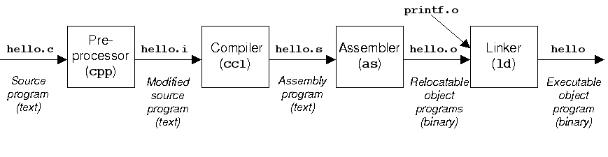

# From source to executable 

- [The Compilation System](#the-compilation-system)
  - [Preprocessing (Still `C` code)](#preprocessing-still-c-code)
  - [Compilation (The `Assembly` code)](#compilation-the-assembly-code)
  - [Assembled (Relocatable Object File)](#assembled-relocatable-object-file)
    - [A binary file cannot be viewed using text viewing tools...](#a-binary-file-cannot-be-viewed-using-text-viewing-tools)
- [The linked binary](#the-linked-binary)

---

You can get the examples that follow by copying folder lecture1 to your current directory:

```bash
$ cp -r ../jstillwe/public/lecture1 .
$ ls
hello  hello.c  hello.o hello.s  lecture1
$ cd lecture1
$ ls
arithmetic.c  count.c            loops.c             pointers5.c  struct3.c
array2D.c     data-types.c       malloc_example0.c   pointers6.c  struct.c
arrays.c      demo1.c            malloc_example1A.c  pointers7.c  sum.c
ascii.c       fileIO_example1.c  malloc_example1.c   pointers.c   temp.c
blocks.c      fileIO_example2.c  malloc_example2.c   power.c      terminal.c
cmdline0.c    flow.c             pointers2.c         sort.c       test.txt
cmdline1.c    getopt_example.c   pointers3.c         str.c
count2.c      hello.c            pointers4.c         struct2.c
```

## The Compilation System

`hello.c` is compiled as follows:
```bash
$ gcc -o hello hello.c
```

A whole bunch of stuff happens when you run this command:


The compilation system performs the translation of the source file hello.c to an executable hello which consists of a sequence of low-level machine language instructions.

---

### Preprocessing (Still `C` code)

To obtain the "preprocessed" source program hello.i, do: 

```bash 
$ gcc -E hello.c
```

---

### Compilation (The `Assembly` code)

To obtain the assembly program `hello.s`, do:

```bash
$ gcc -S hello.c
$ ls
hello  hello.c  hello.s
```

Use `bat` (or `more`) to view the file
```asm
$ bat hello.s
    .file    "hello.c"
    .text
    .section    .rodata
.LC0:
    .string    "hello, world"
    .text
    .globl    main
    .type    main, @function
main:
.LFB0:
    .cfi_startproc
    pushq    %rbp
    .cfi_def_cfa_offset 16
    .cfi_offset 6, -16
    movq    %rsp, %rbp
    .cfi_def_cfa_register 6
    movl    $.LC0, %edi
    call    puts
    movl    $0, %eax
    popq    %rbp
    .cfi_def_cfa 7, 8
    ret
    .cfi_endproc
.LFE0:
    .size    main, .-main
    .ident    "GCC: (GNU) 8.4.1 20200928 (Red Hat 8.4.1-1.0.1)"
    .section    .note.GNU-stack,"",@progbits
```

---

### Assembled (Relocatable Object File)

To obtain the relocatable object file (binary file that is not yet executable because it is not linked to
helper library functions) hello.o, do:

```bash
$ gcc -c hello.c
$ ls
hello  hello.c  hello.o  hello.s
```

#### A binary file cannot be viewed using text viewing tools...

```bash
$ more hello.o

******** hello.o: Not a text file ********
```

## The linked binary

This brings us back to the first command: 

```bash
$ gcc -o hello hello.c
```

This creates the `-o`utput binary that we can run: `hello` 
